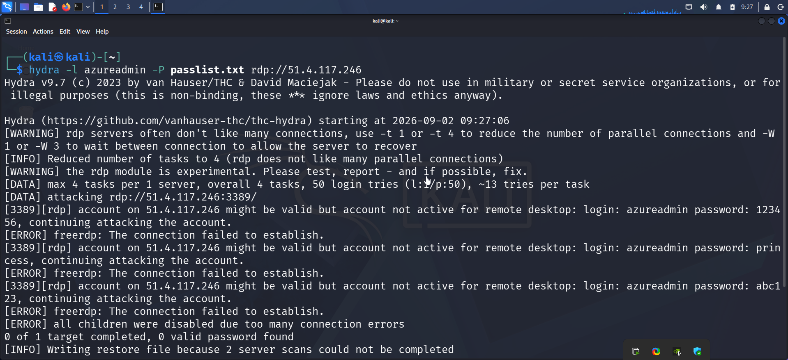
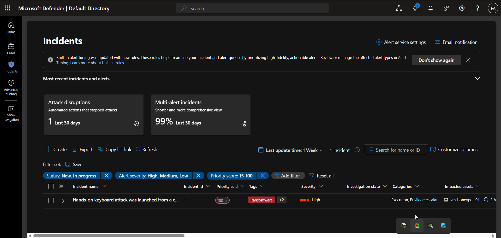
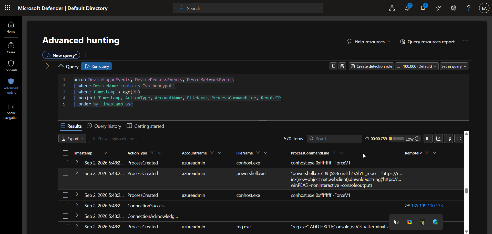
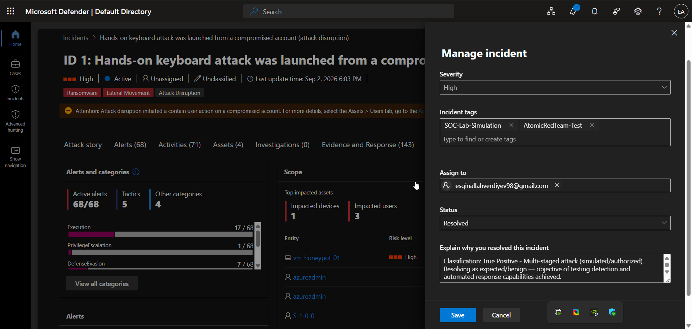
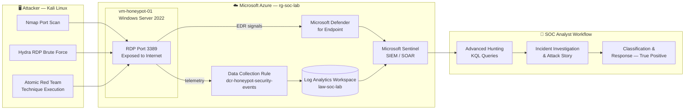

# Cloud SOC Lab: Detecting & Responding to a Simulated RDP Compromise on Azure

**A hands-on, self-built Security Operations Center (SOC) lab using Microsoft Sentinel, Microsoft Defender for Endpoint, and Azure infrastructure — built to simulate, detect, investigate, and respond to a realistic attack chain against an internet-facing Windows host.**

[](#)
[](#)
[](#)
[](#)
[](#)
[](#)

---

## 📌 Overview

This repository documents an end-to-end cloud SOC lab I designed and executed independently to develop and demonstrate practical **blue team / SOC analyst** skills. The project is part of my hands-on preparation alongside a Microsoft-tooling-focused cybersecurity internship (Solvas), where I wanted to go beyond the training material and build my own detection lab to practice real investigation and response workflows for interviews and day-to-day SOC work.

I deployed a deliberately exposed **"honeypot" Windows Server VM** in Azure, attacked it from a **Kali Linux** machine using real offensive tooling (Hydra, Nmap) and the **Atomic Red Team** framework (mapped to MITRE ATT&CK), then used **Microsoft Sentinel** and **Microsoft Defender for Endpoint** to detect, investigate, correlate, and respond to the resulting incident — the same workflow a SOC Analyst / Tier 1–2 Security Analyst performs in production.

> ⚠️ **Ethical use notice:** All activity in this lab was performed against infrastructure I own and control, in an isolated Azure resource group created solely for this exercise. No third-party systems were targeted. This repository is for educational and portfolio purposes only.

---

## 🖼️ Lab Highlights

| Brute-force attack (Hydra → RDP) | High-severity incident in Defender |
|---|---|
|  |  |

| Advanced Hunting — correlated attack timeline | Incident classified & resolved |
|---|---|
|  |  |

More screenshots for every stage of the lab are embedded directly in the [`docs/`](docs/) walkthroughs.

---

## 🎯 Objectives

- Build a realistic, monitored attack surface in Azure from scratch (infrastructure-as-you-go, via the Azure Portal).
- Practice offensive techniques safely against my own honeypot to understand attacker behavior.
- Configure Microsoft Sentinel as a centralized SIEM with a Log Analytics Workspace and data connectors.
- Onboard Microsoft Defender for Endpoint (via Defender for Cloud plans) for endpoint telemetry and automated response.
- Use **Atomic Red Team** to safely simulate real MITRE ATT&CK techniques (discovery, credential access, persistence).
- Detect the attack via **Advanced Hunting (KQL)**, investigate the generated incident, and document the full attack story.
- Apply basic **cloud cost governance** (budgets & alerts) — a practical skill often overlooked in home labs.

---

## 🏗️ Lab Architecture



| Component | Purpose |
|---|---|
| **Resource Group** (`rg-soc-lab`) | Logical container isolating all lab resources |
| **Virtual Machine** (`vm-honeypot-01`) | Windows Server 2022 Datacenter (Azure Edition, Hotpatch), deliberately exposed on port 3389 (RDP) to act as a honeypot |
| **Log Analytics Workspace** (`law-soc-lab`) | Central data store for security telemetry |
| **Data Collection Rule** (`dcr-honeypot-security-events`) | Streams Windows Security Event logs from the VM into the workspace via the Azure Monitor Agent (AMA) |
| **Microsoft Defender for Cloud / Endpoint** | Endpoint Detection & Response (EDR) — process, network, and logon telemetry, automated incident creation, and attack disruption |
| **Microsoft Sentinel** | Cloud-native SIEM layered on the workspace for centralized detection, hunting, and incident management |
| **Cost Management Budget** (`soc-lab-budget`) | Monthly spend alert to keep the lab within a controlled budget |

---

## 🗺️ Attack Chain Summary (MITRE ATT&CK)

| Phase | Technique | ID | Tooling Used |
|---|---|---|---|
| Reconnaissance | Active Scanning | [T1595](https://attack.mitre.org/techniques/T1595/) | Nmap (port 3389 scan) |
| Initial Access | Brute Force | [T1110.001](https://attack.mitre.org/techniques/T1110/001/) | Hydra against RDP |
| Initial Access | Valid Accounts (RDP) | [T1078](https://attack.mitre.org/techniques/T1078/) | FreeRDP (`xfreerdp`) |
| Discovery | System Information Discovery | [T1082](https://attack.mitre.org/techniques/T1082/) | Atomic Red Team |
| Discovery | System Owner/User Discovery | [T1033](https://attack.mitre.org/techniques/T1033/) | `whoami`, `hostname`, `net` |
| Credential Access | OS Credential Dumping (LSASS) | [T1003.001](https://attack.mitre.org/techniques/T1003/001/) | Atomic Red Team |
| Persistence / Execution | Scheduled Task/Job | [T1053.005](https://attack.mitre.org/techniques/T1053/005/) | Atomic Red Team |
| Execution | Command & Scripting Interpreter: PowerShell | [T1059.001](https://attack.mitre.org/techniques/T1059/001/) | PowerShell download cradles |
| Command & Control | Ingress Tool Transfer | [T1105](https://attack.mitre.org/techniques/T1105/) | `IEX`/`DownloadString` from a remote host |

Full narrative with screenshots: **[`docs/03-attack-simulation.md`](docs/03-attack-simulation.md)**

---

## 🚨 Incident Outcome

Microsoft Defender automatically correlated the activity into a single, high-fidelity incident:

> **"Hands-on keyboard attack was launched from a compromised account (attack disruption)"**
> **Severity: High** · **68 alerts** · **71 activities** · **4 impacted assets** (1 device, 3 accounts) · **143 evidence & response items**

Key detections inside the incident included a malicious script with suspicious content, a prevented **CryptInject**-family malware execution, and a possible **AMSI tampering** attempt. Microsoft Defender's **automatic attack disruption** capability contained the compromised account mid-attack, before manual analyst response.

**Final classification:** `True Positive — Multi-staged attack (simulated/authorized)`, resolved after confirming the detection and automated response objectives were met.

Full investigation write-up: **[`docs/04-detection-investigation-response.md`](docs/04-detection-investigation-response.md)**

---

## 📁 Repository Structure

```
.
├── README.md                              # You are here
├── docs/
│   ├── 01-lab-architecture.md             # Design decisions & resource layout
│   ├── 02-infrastructure-deployment.md    # Step-by-step Azure build-out
│   ├── 03-attack-simulation.md            # Offensive activity walkthrough
│   ├── 04-detection-investigation-response.md  # Blue team investigation
│   └── 05-cost-governance.md              # Budget & cost alerting
├── kql-queries/                           # Reusable Sentinel / Defender KQL
│   ├── 01-failed-rdp-logons-brute-force.kql
│   ├── 02-recon-commands-hunting.kql
│   ├── 03-suspicious-powershell-hunting.kql
│   ├── 04-network-events-hunting.kql
│   └── 05-union-attack-timeline-correlation.kql
└── screenshots/
    ├── 01-infrastructure-deployment/      # 17 screenshots
    ├── 02-attack-simulation/              # 8 screenshots
    └── 03-detection-and-response/         # 18 screenshots
```

---

## 🛠️ Skills Demonstrated

- **SIEM operations** — Microsoft Sentinel workspace configuration, data connectors, incident triage
- **EDR / XDR** — Microsoft Defender for Endpoint advanced hunting, incident management, attack disruption
- **KQL (Kusto Query Language)** — writing custom detection & hunting queries across `SecurityEvent`, `DeviceProcessEvents`, `DeviceNetworkEvents`, `DeviceLogonEvents`
- **MITRE ATT&CK mapping** — tagging real activity to tactics/techniques for structured reporting
- **Offensive security fundamentals** — Nmap scanning, Hydra brute forcing, RDP exploitation (used purely to generate realistic detection data)
- **Adversary emulation** — Atomic Red Team test execution and validation of detections
- **Cloud infrastructure (Azure)** — resource groups, VM deployment, network security, Log Analytics, Data Collection Rules
- **Incident response workflow** — alert triage → investigation → correlation → classification → resolution
- **Cloud cost governance** — budgets and spend alerts

---

## 🔁 How to Reproduce This Lab

A step-by-step build guide is documented in **[`docs/02-infrastructure-deployment.md`](docs/02-infrastructure-deployment.md)**. At a high level:

1. Create a dedicated resource group and Log Analytics Workspace.
2. Deploy a Windows Server VM with RDP (3389) intentionally exposed via the NSG.
3. Enable Microsoft Defender for Cloud plans and connect Microsoft Sentinel to the workspace.
4. Install the Windows Security Events (AMA) data connector and create a Data Collection Rule targeting the VM.
5. From a separate Kali Linux VM/host, scan and brute-force the honeypot, then run Atomic Red Team tests against it.
6. Hunt for the activity in Sentinel/Defender using the queries in [`kql-queries/`](kql-queries/), and work the resulting incident end to end.
7. **Tear down the resource group when finished** to avoid ongoing Azure charges.

---

## 📎 Notes

- All IP addresses, hostnames, and identifiers shown in the screenshots belong to short-lived, disposable lab resources and are no longer active.
- Offensive tools (Hydra, Nmap, Atomic Red Team) were used strictly against infrastructure I own, for defensive-skill development. Please only use these tools against systems you are authorized to test.

---

## 👤 About Me

Eshgin Allahverdiyev — SOC Analyst focused on blue team / defensive security, based in Baku, Azerbaijan. This lab was built alongside a Microsoft-tooling cybersecurity internship (Solvas) to strengthen hands-on detection and incident response skills.

[LinkedIn](#) · [Email](#)
