# 02 — Infrastructure Deployment

This document walks through the Azure build-out, step by step, in the order it was actually performed.

## 1. Resource Group

A dedicated resource group keeps the lab isolated and easy to tear down in one action.

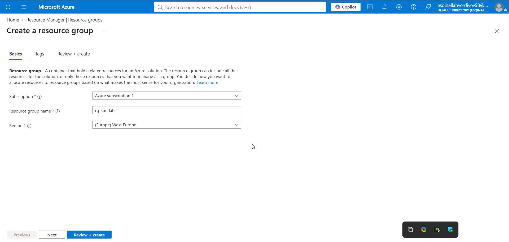
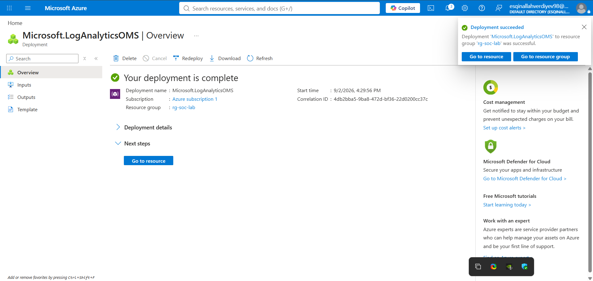

## 2. Registering the Security Resource Provider

Before Defender/Sentinel features can be enabled on the subscription, the `Microsoft.Security` resource provider must be registered.

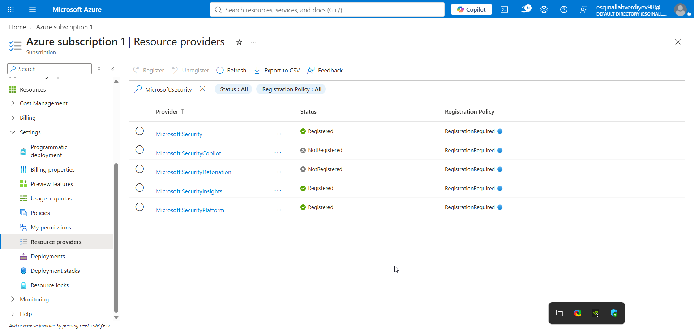

## 3. Log Analytics Workspace

`law-soc-lab` is the central data store that both Sentinel and the Windows Security Events data connector write into.

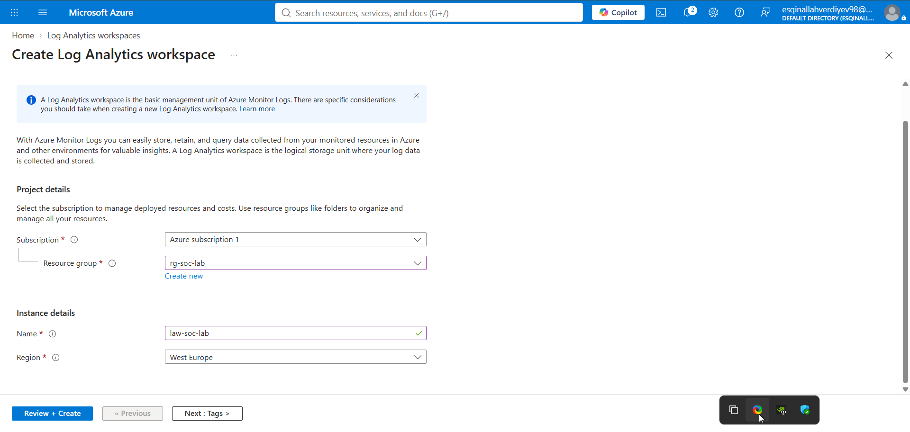
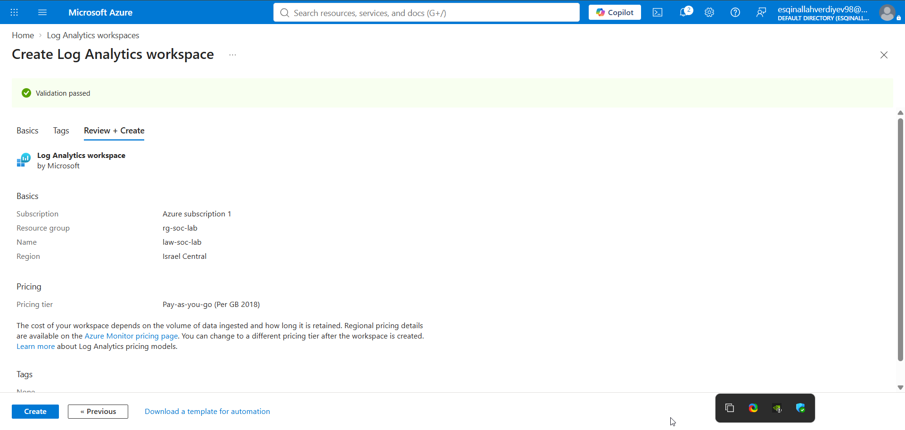

## 4. Honeypot Virtual Machine

`vm-honeypot-01` — a Windows Server 2022 Datacenter (Azure Edition, Hotpatch) VM — is the intentionally exposed target of the lab.

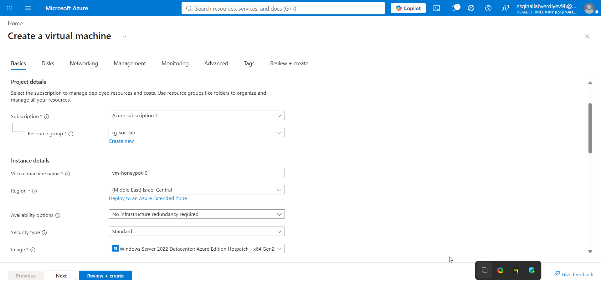

RDP (port 3389) was deliberately left open to any source on the Network Security Group, so the VM would organically attract/allow brute-force traffic from the attacker machine:

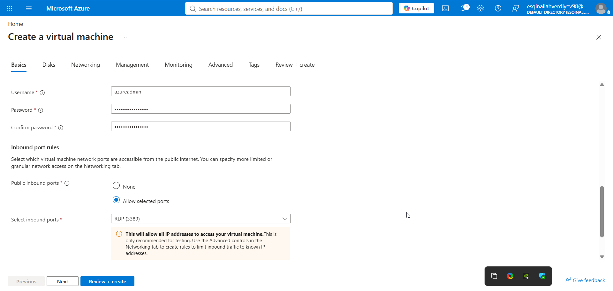
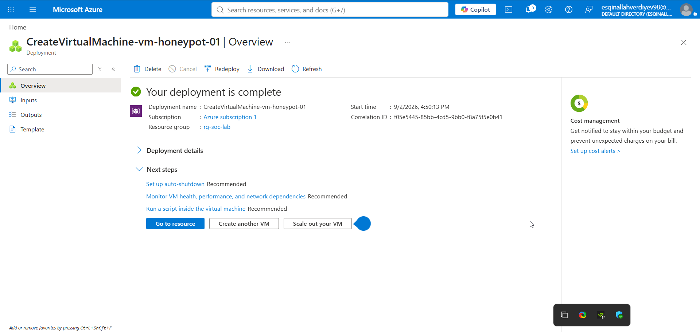
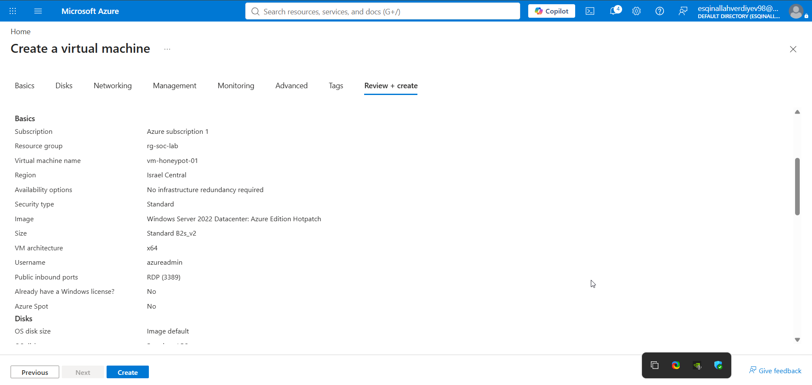

## 5. Enabling Microsoft Defender Plans

Defender for Servers / Endpoint plans were enabled at the subscription level, giving the VM EDR coverage (process, network, and logon telemetry, plus automated incident correlation).

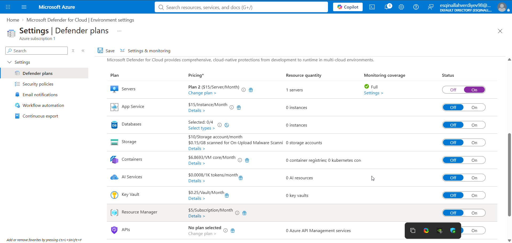

## 6. Adding Microsoft Sentinel to the Workspace

Sentinel was layered on top of `law-soc-lab` to act as the SIEM/SOAR front end for the lab.

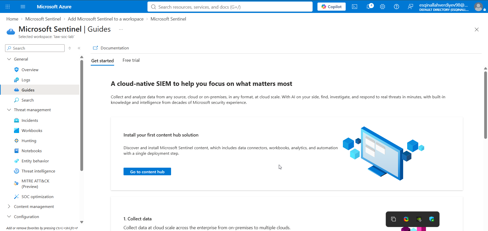

## 7. Data Connectors & Data Collection Rule

The **Windows Security Events via AMA** connector was installed to stream Windows Event Log data (including logon failures, Event ID 4625) from the honeypot into the workspace. A **Data Collection Rule** (`dcr-honeypot-security-events`) was created to scope this collection specifically to `vm-honeypot-01`.

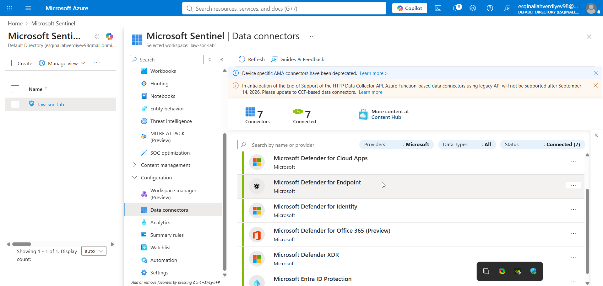
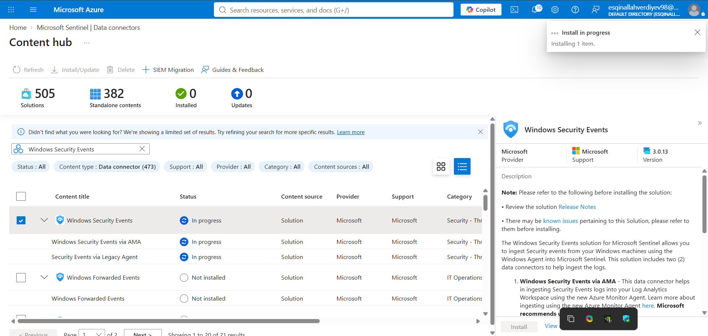
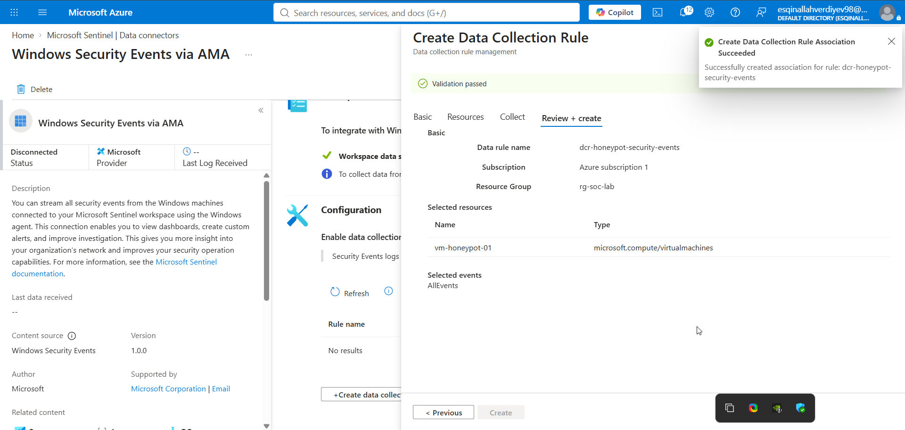

## 8. Cost Governance

A monthly budget (`soc-lab-budget`, $180/month threshold) with an alert rule was configured to keep spend under control for the duration of the lab — see [`05-cost-governance.md`](05-cost-governance.md) for details.

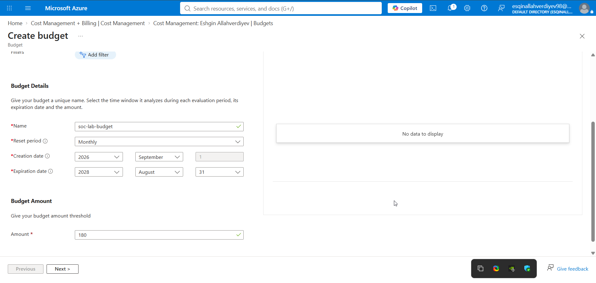
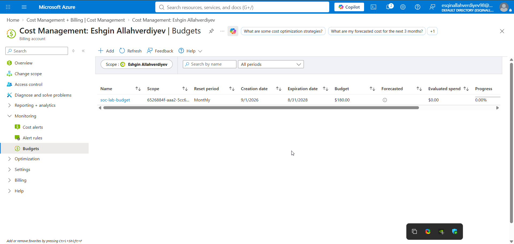

---

With infrastructure, data collection, and monitoring in place, the environment was ready for the attack simulation phase.

⬅ [Back: 01 — Lab Architecture](01-lab-architecture.md) | Next: [03 — Attack Simulation](03-attack-simulation.md) ➡
