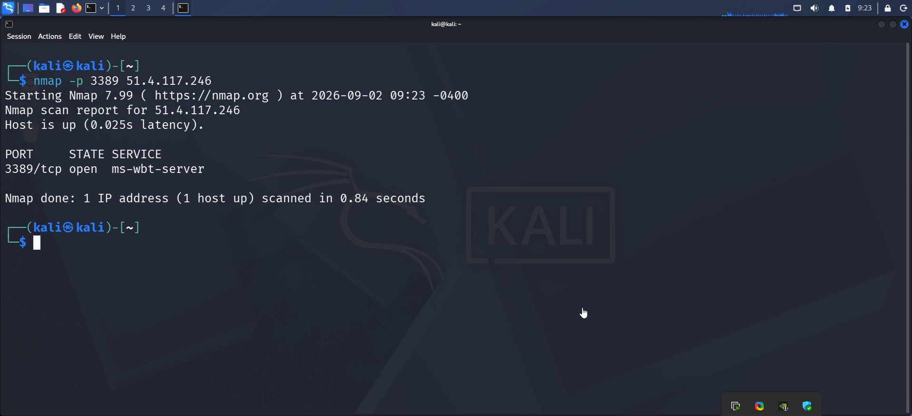
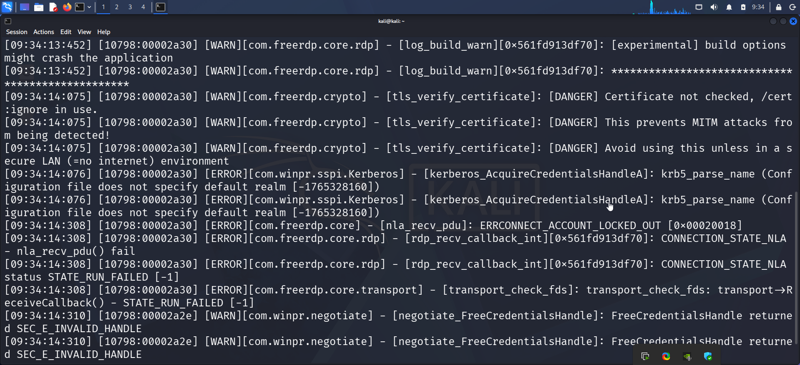
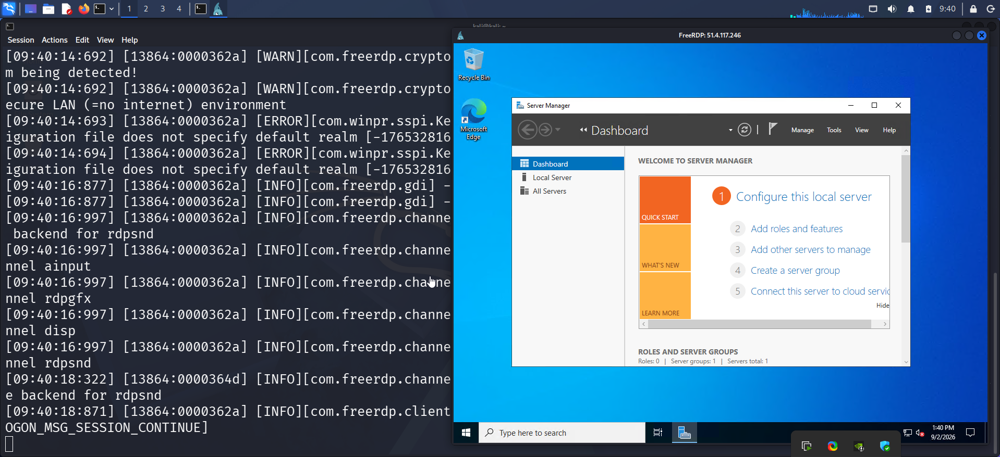
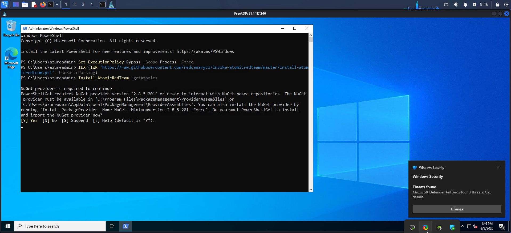
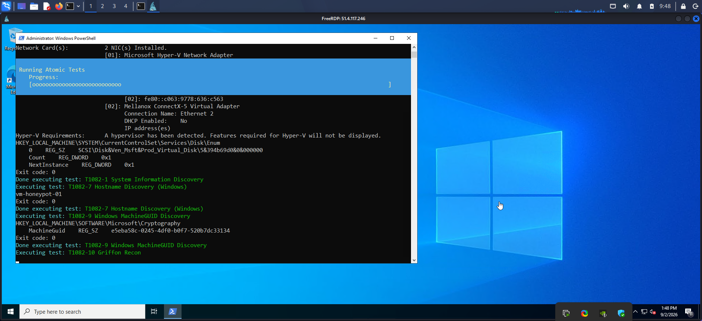
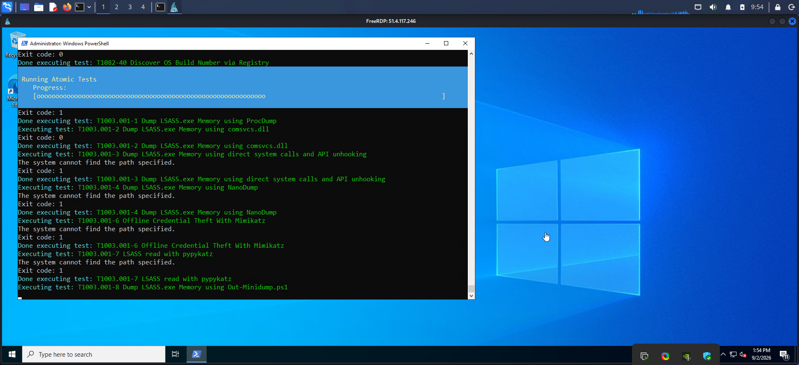
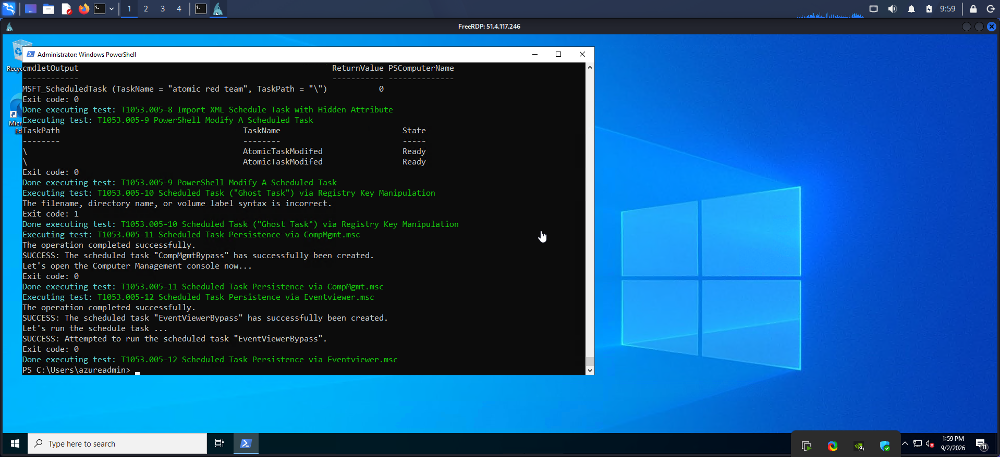

# 03 — Attack Simulation

With the honeypot deployed and telemetry pipelines live, the attack phase was carried out from a separate **Kali Linux** machine acting as an external threat actor, followed by **Atomic Red Team** to broaden the attack chain beyond initial access.

## Phase 1 — Reconnaissance

The public IP of `vm-honeypot-01` was scanned to confirm RDP (3389) was reachable — the same step a real opportunistic attacker performs when sweeping the internet for exposed services.

*(MITRE ATT&CK: [T1595 — Active Scanning](https://attack.mitre.org/techniques/T1595/))*

## Phase 2 — Brute Force & Initial Access

**Hydra** was used to brute force the `azureadmin` account over RDP with a small password list, simulating a credential-stuffing / brute-force campaign against an exposed remote-access service.

*(MITRE ATT&CK: [T1110.001 — Brute Force: Password Guessing](https://attack.mitre.org/techniques/T1110/001/))*

The repeated failed attempts triggered Windows' built-in account lockout policy — a good real-world reminder that lockout policies double as a (crude) brute-force control:

Once a valid credential pair was confirmed, a full interactive session was established using `xfreerdp`, representing successful initial access via valid/compromised credentials.

*(MITRE ATT&CK: [T1078 — Valid Accounts](https://attack.mitre.org/techniques/T1078/))*

## Phase 3 — Adversary Emulation with Atomic Red Team

To generate a realistic, multi-technique attack chain beyond a single brute-force event, [**Atomic Red Team**](https://github.com/redcanaryco/atomic-red-team) (an open-source library of small, discrete tests mapped directly to MITRE ATT&CK techniques) was installed on the compromised host and executed post-logon.

**T1082 — System Information Discovery**: enumerating OS build/version information, as an attacker would when profiling a freshly compromised host.

**T1003.001 — OS Credential Dumping: LSASS Memory**: a battery of credential-access sub-tests (ProcDump, comsvcs.dll, Mimikatz-style offline theft, pypykatz, etc.) executed against LSASS memory to simulate credential-harvesting behavior.

**T1053.005 — Scheduled Task/Job**: simulating a common Windows persistence mechanism used by attackers to maintain access across reboots.

Alongside the Atomic Red Team battery, additional hands-on-keyboard activity was performed manually on the host — discovery commands (`whoami`, `hostname`, `net`), PowerShell download-cradle style commands, and outbound connections to external infrastructure — to more closely emulate a real intrusion rather than an isolated test run. The full detail of what was captured is documented in [`04-detection-investigation-response.md`](04-detection-investigation-response.md).

---

⬅ [Back: 02 — Infrastructure Deployment](02-infrastructure-deployment.md) | Next: [04 — Detection, Investigation & Response](04-detection-investigation-response.md) ➡
