# 04 — Detection, Investigation & Response

This is the core of the lab: taking the attack traffic generated in [`03-attack-simulation.md`](03-attack-simulation.md) and working it the way a SOC Analyst would — detect, hunt, correlate, investigate, classify, and respond.

## 1. Detecting the Brute Force in Sentinel

The first signal reviewed was raw Windows Security Event data ingested into `law-soc-lab`. Filtering for **Event ID 4625** (failed logon) immediately surfaced the brute-force attempt: **87 failed logon events** against the `azureadmin` account on `vm-honeypot-01` in a short window — a textbook brute-force pattern (high frequency, same account, same source type, all failures).

```kql
SecurityEvent
| where EventID == 4625
| order by TimeGenerated desc
```


After the successful compromise and Atomic Red Team execution, the same workspace showed a sharp increase in security events correlating with the attack window:

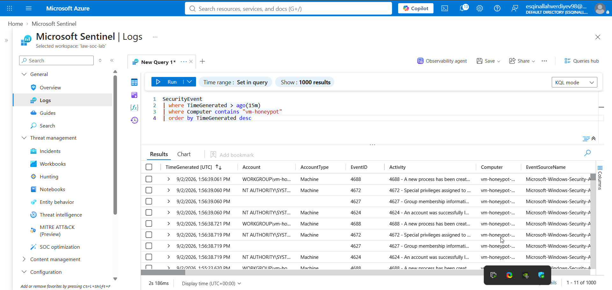

## 2. Endpoint Detection in Microsoft Defender

On the EDR side, Microsoft Defender for Endpoint independently flagged the Atomic Red Team activity as malicious/suspicious behavior in real time — validating that the emulated techniques produced genuine, detectable signal rather than being silently missed.

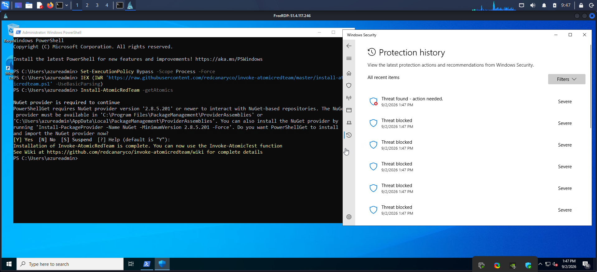
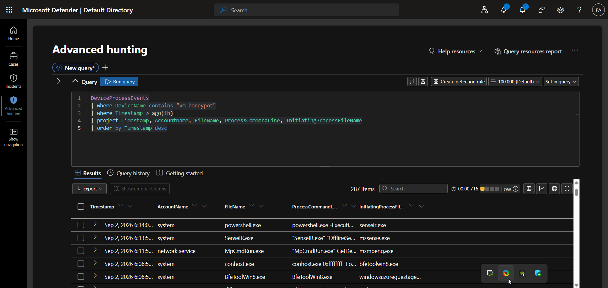

## 3. Threat Hunting with KQL (Advanced Hunting)

Beyond the automatic alerts, manual hunting queries were written to actively pull evidence — the core analytical skill of threat hunting rather than passive alert-watching. All queries are saved in [`kql-queries/`](../kql-queries/).

### 3.1 Discovery / reconnaissance commands

```kql
DeviceProcessEvents
| where DeviceName contains "vm-honeypot"
| where FileName in~ ("whoami.exe", "systeminfo.exe", "net.exe", "hostname.exe", "nltest.exe")
| project Timestamp, AccountName, FileName, ProcessCommandLine, InitiatingProcessFileName
| order by Timestamp desc
```

16 matching events surfaced `whoami.exe`, `hostname.exe`, and `net.exe` spawned from `powershell.exe` under the `azureadmin` account — consistent with an attacker profiling the host immediately after gaining access (T1082 / T1033).

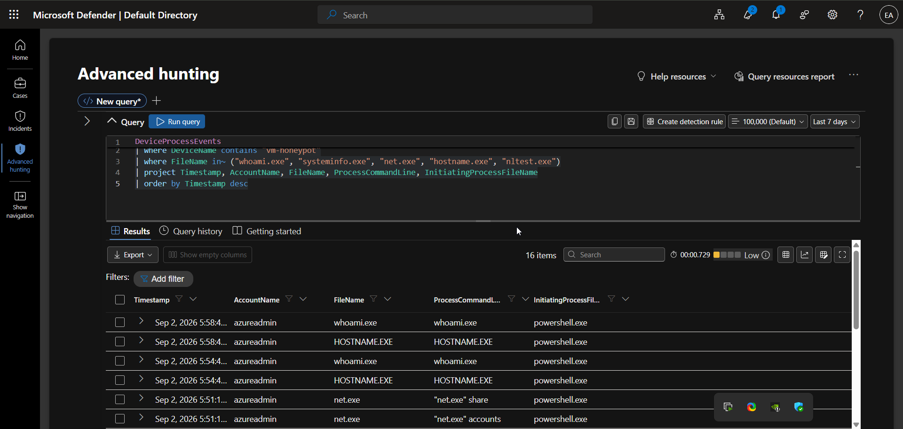

### 3.2 Suspicious PowerShell usage

```kql
DeviceProcessEvents
| where DeviceName contains "vm-honeypot"
| where FileName in~ ("powershell.exe", "pwsh.exe")
| where ProcessCommandLine has_any ("IEX", "DownloadString", "Invoke-Expression", "Bypass", "hidden")
| project Timestamp, AccountName, ProcessCommandLine
| order by Timestamp desc
```

13 matching events, including an `IEX`/`DownloadString` download-cradle pattern and a simulated `Invoke-MalDoc` macro execution — the kind of PowerShell abuse that's a high-value detection target in real environments (T1059.001).

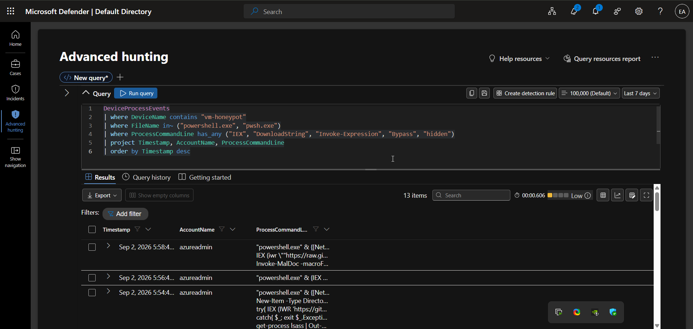

### 3.3 Outbound network activity

```kql
DeviceNetworkEvents
| where DeviceName contains "vm-honeypot"
| where Timestamp > ago(2h)
| project Timestamp, RemoteIP, RemoteUrl, RemotePort, InitiatingProcessFileName
| order by Timestamp desc
```

280 connection events reviewed, including outbound HTTPS traffic from `powershell.exe` to a GitHub raw-content endpoint — consistent with a payload being staged/retrieved from external infrastructure (T1105).

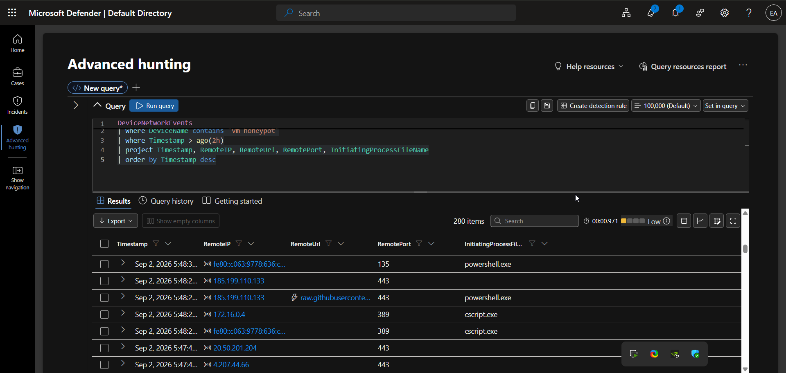

### 3.4 Building a unified attack timeline

To reconstruct the full attack narrative for reporting, logon, process, and network telemetry were correlated into a single chronological view:

```kql
union DeviceLogonEvents, DeviceProcessEvents, DeviceNetworkEvents
| where DeviceName contains "vm-honeypot"
| where Timestamp > ago(2h)
| project Timestamp, ActionType, AccountName, FileName, ProcessCommandLine, RemoteIP
| order by Timestamp asc
```

570 correlated events — this single query is what turns raw logs into a readable incident timeline (logon → discovery → execution → outbound connection), and is the same technique used to write the incident attack story below.


## 4. Incident Management in Microsoft Defender

Microsoft Defender's correlation engine automatically grouped 68 related alerts into a single, high-severity incident:

> **"Hands-on keyboard attack was launched from a compromised account (attack disruption)"**


### Attack story & scope

| Metric | Value |
|---|---|
| Severity | High |
| Status | Active → Resolved |
| Active alerts | 68 / 68 |
| Activities | 71 |
| Impacted assets | 4 (1 device, 3 accounts) |
| Evidence & response items | 143 |
| Tags | Ransomware, Lateral Movement, Attack Disruption |
| First activity | Sep 2, 2026, 5:34:14 PM |
| Last activity | Sep 2, 2026, 5:57:04 PM |

Notable alert types flagged inside the incident included a script with suspicious content, a **prevented** execution of `CryptInject`-family malware, and a possible **AMSI tampering** attempt — Defender's built-in **attack disruption** capability automatically contained the compromised account mid-incident, without waiting for manual analyst action.

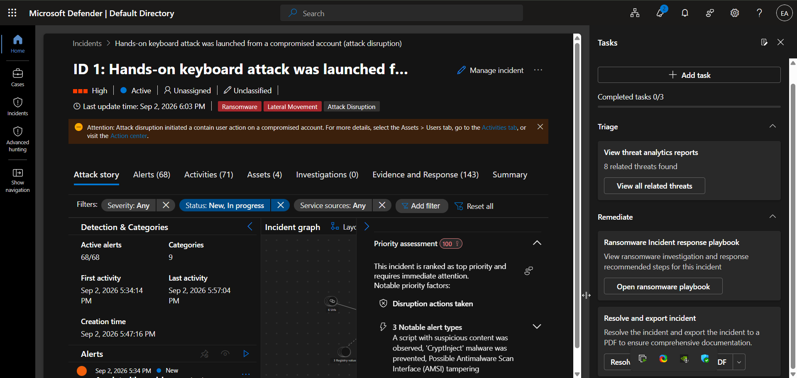
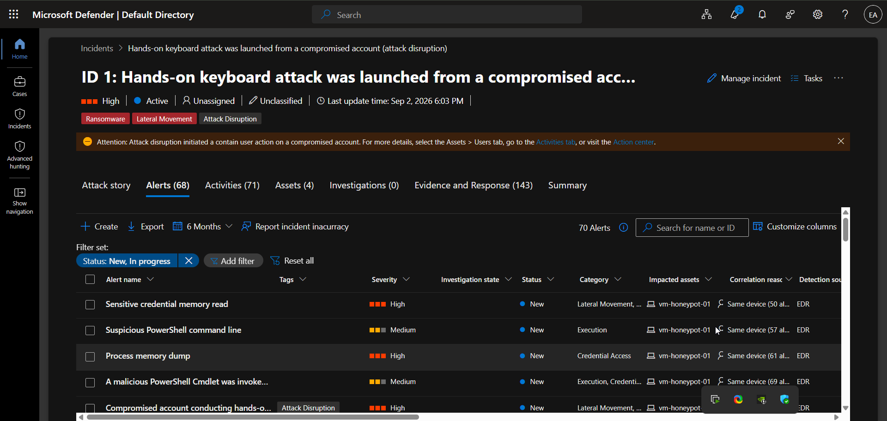
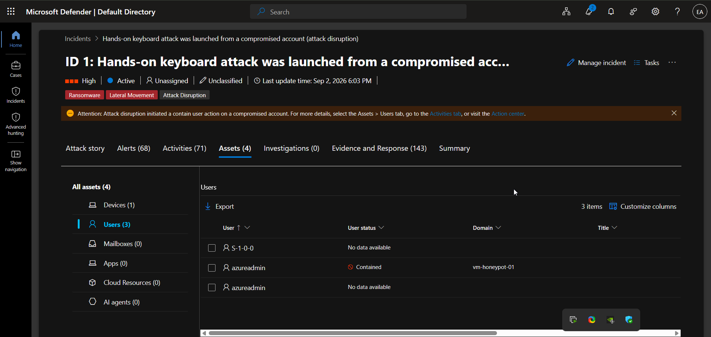

### Evidence & automated response

Out of 143 tracked evidence and response items, several malicious actions were **automatically prevented** by Defender before they could execute — demonstrating the value of EDR auto-remediation on top of detection alone.

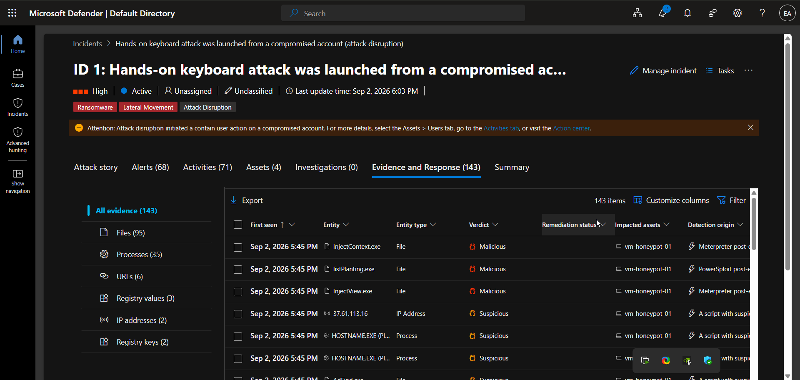
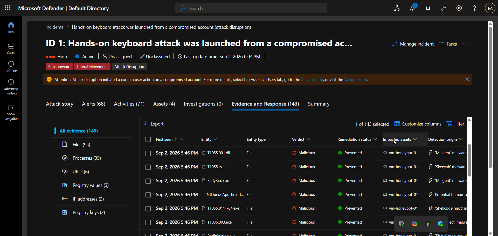

### Investigation graph

The incident graph visually links the compromised device, accounts, processes, and files involved — useful for quickly communicating scope to other analysts or leadership during a live response.

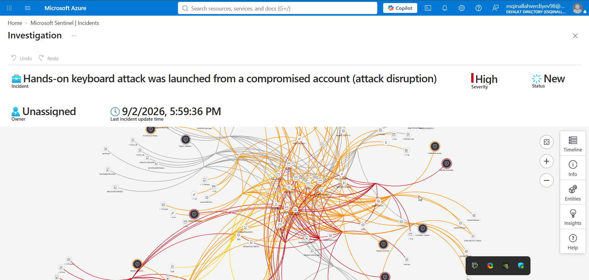
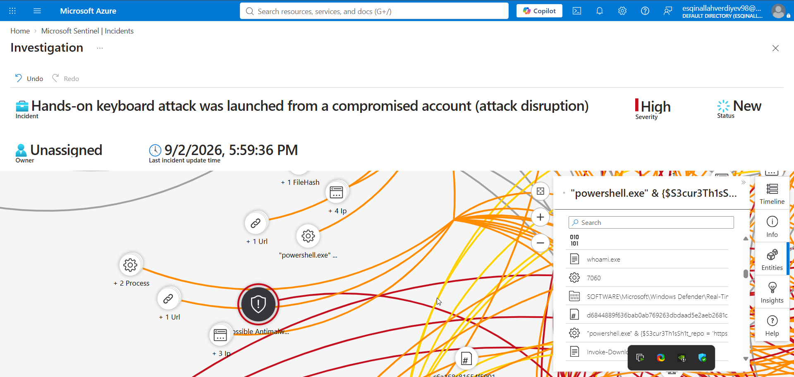

### Correlated view in Sentinel

The same incident is visible from the Sentinel side, confirming end-to-end pipeline integration between Defender and the SIEM:

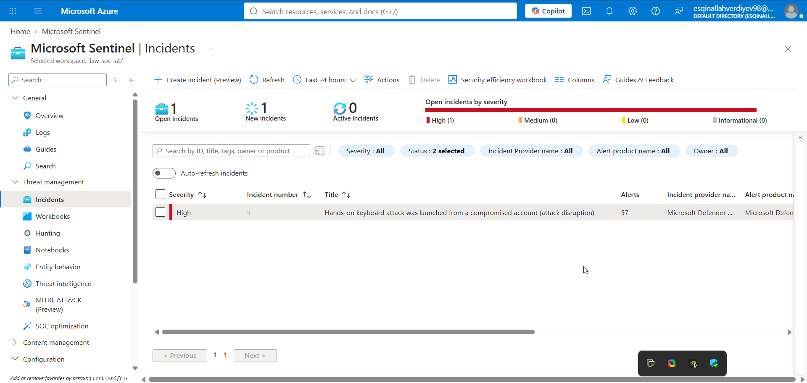

## 5. Classification & Closure

After confirming that every alert in the incident traced back to the controlled simulation (and that Defender's automated response had correctly contained the compromised account), the incident was formally classified and resolved:

- **Severity:** High
- **Tags added:** `SOC-Lab-Simulation`, `AtomicRedTeam-Test`
- **Classification:** *True Positive — Multi-staged attack (simulated/authorized)*
- **Resolution notes:** *"Classification: True Positive – Multi-staged attack (simulated/authorized). Resolving as expected/benign — objective of testing detection and automated response capabilities achieved."*


## 6. Key Takeaways

- **4625 monitoring works** — even without EDR, simple Windows Event Log monitoring (Event ID 4625) is enough to catch a brute-force campaign in progress.
- **Layered telemetry beats a single source** — combining raw Security Events (Sentinel/Log Analytics) with EDR-level process/network telemetry (Defender) gave both breadth (every logon attempt) and depth (full process trees, command lines, and network destinations).
- **Automated response has real value** — Defender's attack disruption feature contained the compromised account without waiting on an analyst, buying critical time during a fast-moving, hands-on-keyboard style attack.
- **KQL is the analyst's real toolkit** — the difference between "an alert fired" and "here's exactly what the attacker did" came entirely from writing targeted hunting queries and correlating tables with `union`.
- **MITRE ATT&CK mapping turns noise into a narrative** — tagging each observed action to a specific technique made it possible to write a clear, structured incident report instead of a raw list of alerts.

---

⬅ [Back: 03 — Attack Simulation](03-attack-simulation.md) | Next: [05 — Cost Governance](05-cost-governance.md) ➡
